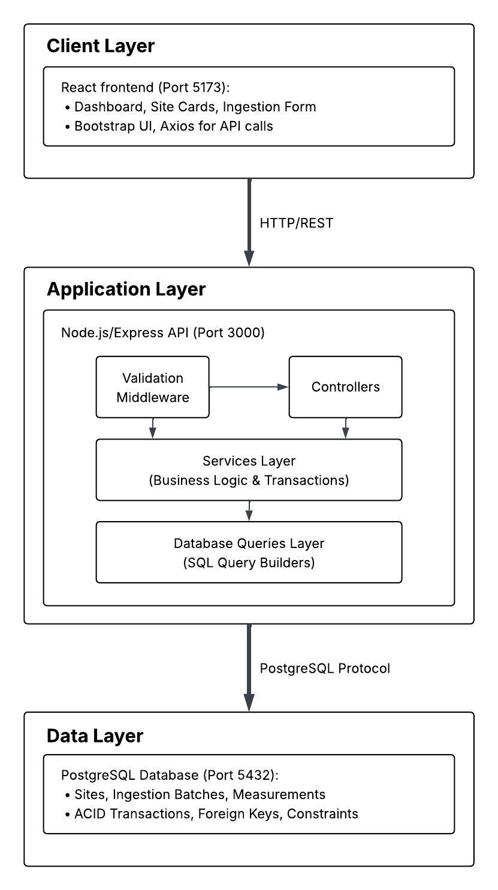

# 🌍 Highwood Emissions Data Platform - Architecture Documentation

## 📋 Table of Contents
- [🌍 Highwood Emissions Data Platform - Architecture Documentation](#-highwood-emissions-data-platform---architecture-documentation)
  - [📋 Table of Contents](#-table-of-contents)
  - [📎 Architectural Overview](#-architectural-overview)
    - [Core Requirements Addressed](#core-requirements-addressed)
  - [⚙ System Architecture](#-system-architecture)
    - [High-Level Architecture](#high-level-architecture)
  - [🧠 Design Decisions](#-design-decisions)
    - [1. Idempotency through Client-Generated Batch IDs](#1-idempotency-through-client-generated-batch-ids)
    - [2. Atomic Transactions For Ingestion](#2-atomic-transactions-for-ingestion)
    - [3. Concurrency Control Strategy](#3-concurrency-control-strategy)
    - [4. Database Schema Design](#4-database-schema-design)
    - [5. Validation \& Error Strategy](#5-validation--error-strategy)
    - [6. Layered Architecture](#6-layered-architecture)
  - [💻 Backend Architecture](#-backend-architecture)
    - [Request Lifecycle](#request-lifecycle)
    - [Error Handling](#error-handling)
  - [🌐 Frontend Architecture](#-frontend-architecture)
    - [State Management](#state-management)
    - [Network Resilience \& Retry Handling](#network-resilience--retry-handling)
  - [🚀 Future Improvements](#-future-improvements)
    - [Current Limitations](#current-limitations)
    - [Future Enhancements](#future-enhancements)


## 📎 Architectural Overview
This platform provides real-time monitoring of industrial site emissions with a focus on data integrity, network resilience, and atomic operations. The system is designed to handle high-concurrency updates while preventing duplicate data even under unstable network conditions.

### Core Requirements Addressed

- Asset Management (Sites)
- Reliable Batch Ingestion with Idempotency
- Atomic Transactions
- Analytics & Compliance Status
- React-based Monitoring Dashboard
- Concurrency Control via Row-Level Locking
- Centralized Validation using Zod

## ⚙ System Architecture

### High-Level Architecture


## 🧠 Design Decisions

### 1. Idempotency through Client-Generated Batch IDs

Field devices or engineers may retry requests due to timeouts, risking duplicate data. As such, the client generates a unique `batch_id` and retries the ingestion request with the same ID. If the batch already exists, the system safely skips re-processing.

**Reason For Decision**:
- No server-side state required
- Works across multiple API instances

### 2. Atomic Transactions For Ingestion
All ingestion operations occur within a single database transaction:
1. Insert ingestion batch
2. Insert measurements
3. Lock the site row
4. Update total emissions
5. Commit, or rollback entire operation on error

**Reason For Decision**:
- All-or-nothing behavior
- No partial ingestion

### 3. Concurrency Control Strategy
Concurrent updates are handled through pessimistic locking using `SELECT ... FOR UPDATE`.

**Reason For Decision**:
- Simple and reliable
- Prioritizes correctness
- Prevents race conditions

**Trade-off**:
Concurrent updates queue up under contention, potentially affecting performance. However, strict consistency is required for this case, making it a reasonable choice.


### 4. Database Schema Design
**Tables**:
- `sites`
- `ingestion_batches`
- `measurements`

**Key Aspects**:
- `sites` contains a `total_emissions_to_date` property.
- `measurements` has a `UNIQUE (site_id, batch_id, measured_at)` constraint.
- `measurements` references the `sites` and `ingestion_batches` tables.

**Reason For Decision**:
- It is much faster to update `total_emissions_to_date` per ingestion and read it later, instead of aggregating all site measurements to calculate the total.
- The purpose of `ingestion_batches` is idempotency, as explained earlier in the document.
- The `UNIQUE` constraint in the `measurements` table ensures that no measurement duplication occurs within the same batch.

### 5. Validation & Error Strategy
All input validation is centralized using Zod schemas, and all errors have a unified structure.

**Reason For Decision**:
- Cleaner controllers
- Clear error responses
- Easy to share and add more schemas in the future

### 6. Layered Architecture
The codebase is structured as follows
```
apps/
├── api/src/
|   ├── constants/
|   ├── controllers/
|   ├── controllers/
│   ├── db/
│   ├── middlewares/
│   ├── queries/
│   ├── routes/
│   ├── services/
│   ├── tests/
│   ├── utils/
│   └── validation/
└── web/src/
    ├── components/
    └── services/

```
**Reason For Decision**
- Clear seperation of concerns
- Testable business logic
- Maintainable and extendable structure

## 💻 Backend Architecture

### Request Lifecycle
1. Request received and assigned ID
2. JSON parsing
3. Zod validation
4. Controller orchestration
5. Service executes transaction
6. Database interaction
7. Response returned
8. Errors logged and handled centrally

### Error Handling
All errors follow a consistent structure with request tracing support, making it easy for developers to debug issues.
```json
{
    "request_id": "<UUID for traceability>",
    "code": "<Pre-defined error codes>",
    "message": "<Error details>",
}
```

## 🌐 Frontend Architecture

The frontend is a single-page React application centered around an administrative dashboard. It consists of site summary cards for real-time visibility and a manual ingestion form used to simulate sensor data submissions.

### State Management
For this scope, state is managed locally within components. Global state management solutions such as Redux or React Context were intentionally avoided to reduce complexity and because no cross-cutting or shared state requirements exist at this stage.

### Network Resilience & Retry Handling
When an ingestion request fails due to network instability or transient errors, the UI exposes a **Retry** action. Retrying reuses the original `batch_id`, allowing the backend to safely detect duplicate submissions and guarantee idempotent ingestion without double-counting emissions.

## 🚀 Future Improvements

### Current Limitations
- No authentication or authorization
- No rate limiting
- No pagination
- No real-time updates
- Limited test coverage

### Future Enhancements
- JWT / API key authentication
- WebSocket-based real-time updates
- Table partitioning for measurements
- Redis caching for improving performance
- Structured logging and metrics